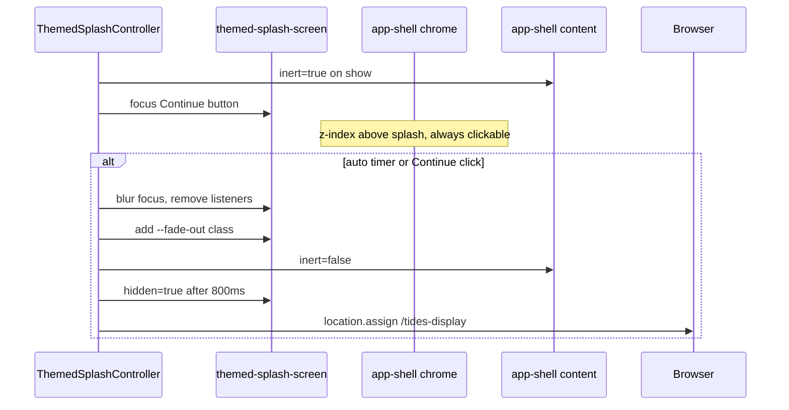

# Accessible Branding Splash — Build Plan

## Root cause

In [`src/lib/ThemedSplashController.js`](src/lib/ThemedSplashController.js), `bindDismissGestures()` sets `tabindex="0"` and calls `focus()` on `#themed-splash-screen`. Later, `dismiss()` and `hideImmediately()` set `aria-hidden="true"` on that same element while it still holds focus — triggering the browser warning.

In [`src/components/ThemedSplashScreen.astro`](src/components/ThemedSplashScreen.astro), `role="dialog"` + `aria-modal="true"` treats the auto-advancing splash as a blocking modal, which requires strict focus-trap semantics the controller does not implement.

## Recommended pattern

**Welcome intro screen** (not modal dialog):

- `role="region"` with `aria-labelledby` pointing at the splash `<h1>`.
- Decorative wave scene keeps `aria-hidden="true"` (unchanged — focus will not land inside it).
- Real interactive control: a `<button type="button">` for Continue.
- Background page content made non-interactive via the native `inert` attribute on `.themed-app-shell__content` + footer while splash is visible; **chrome (menubar + mobile menu) stays interactive**.
- On dismiss: blur / move focus → add CSS fade class → after transition set HTML `hidden` attribute — **never** set `aria-hidden="true"` on a focused ancestor.



---

## Step 1 — Update splash markup

**File:** [`src/components/ThemedSplashScreen.astro`](src/components/ThemedSplashScreen.astro)

- Remove `role="dialog"`, `aria-modal="true"`, and `aria-live="polite"`.
- Add `role="region"` and `aria-labelledby="themed-splash-title"`.
- Add `id="themed-splash-title"` to the existing `<h1>`.
- Add Continue button inside `.themed-splash-screen__content`:

```html
<button
  type="button"
  id="themed-splash-continue"
  class="pure-button pure-button-primary themed-splash-screen__continue"
>
  Continue to Tides
</button>
```

- Update root `aria-label` to a neutral welcome label (remove "Tap to continue").
- Keep `data-next-route` on root element.

---

## Step 2 — Restructure layout so chrome stays above splash

**File:** [`src/layouts/SiteLayout.astro`](src/layouts/SiteLayout.astro)

- Move `<ThemedSplashScreen>` **inside** `.themed-app-shell`, **after** `.themed-app-shell__chrome` and **before** `.themed-app-shell__content`:

```astro
<div class="themed-app-shell" id="themed-app-shell">
  <div class="themed-app-shell__chrome">...</div>
  {showSplash && <ThemedSplashScreen nextRoute={splashNextRoute} />}
  <div class="themed-app-shell__content">...</div>
  <footer>...</footer>
</div>
```

---

## Step 3 — Update splash CSS

**File:** [`src/styles/biycoder-theme-overrides.css`](src/styles/biycoder-theme-overrides.css)

- Change `.themed-splash-screen` from `inset: 0; z-index: 9999` to cover content area only below chrome:

```css
.themed-splash-screen {
  position: fixed;
  top: var(--wtt-chrome-height, 3.5rem);
  left: 0;
  right: 0;
  bottom: 0;
  z-index: 50;
  cursor: default;
}
```

- Define `--wtt-chrome-height` on `.themed-app-shell__chrome`.
- Add `.themed-splash-screen__continue` styles (margin-top, min 44px tap target).
- Add `.themed-splash-screen[hidden] { display: none; }`.
- Add reduced-motion override:

```css
@media (prefers-reduced-motion: reduce) {
  .themed-splash-screen { transition: none; }
}
```

---

## Step 4 — Refactor ThemedSplashController focus and inert lifecycle

**File:** [`src/lib/ThemedSplashController.js`](src/lib/ThemedSplashController.js)

**Constructor** — accept new options:

- `continueBtn` — `#themed-splash-continue` element
- `inertTargetEl` — `.themed-app-shell__content` element (and optionally footer)

**New helper methods:**

| Method | Action |
|--------|--------|
| `setBackgroundInert(inert)` | Toggle `inert` on content/footer |
| `releaseFocus()` | If `document.activeElement` is inside splash, call `.blur()` |
| `focusContinueButton()` | `continueBtn.focus({ preventScroll: true })` with try/catch |

**`bindDismissGestures()` changes:**

- Remove `tabindex="0"` on splash root.
- Remove `focus()` on splash root.
- Call `focusContinueButton()` instead.
- Bind click on `continueBtn` → `dismiss()`.
- Keep click on splash root → `dismiss()` (tap-anywhere preserved).
- Keep keydown on splash root for Escape → `dismiss()` only.

**`dismiss()` / `hideImmediately()` changes:**

- Remove **all** `setAttribute('aria-hidden', 'true')` calls on splash root.
- At start of dismiss: `releaseFocus()`, `unbindDismissGestures()`, `setBackgroundInert(false)`.
- After fade timeout: `splashEl.hidden = true`.
- Then `navigateToNext()` if `nextRoute` set.

**`start()` changes:**

- If showing splash: `setBackgroundInert(true)`, then `bindDismissGestures()`, start display timer.
- If skipping: `hideImmediately()` without inert.
- Honor `prefers-reduced-motion: reduce` — set `fadeDurationMs = 0` and `displayDurationMs = 0`.

---

## Step 5 — Wire new elements in siteChrome.js

**File:** [`src/scripts/siteChrome.js`](src/scripts/siteChrome.js)

```js
const splashEl = document.getElementById('themed-splash-screen')
const continueBtn = document.getElementById('themed-splash-continue')
const inertTargetEl = document.querySelector('.themed-app-shell__content')

const splashController = new ThemedSplashController({
  splashEl,
  continueBtn,
  inertTargetEl,
  nextRoute: splashEl ? (splashEl.dataset.nextRoute || '').trim() : '',
  displayDurationMs: 2000,
  fadeDurationMs: 800
})
```

---

## Step 6 — Preserve existing behavior

| Behavior | Keep as-is |
|----------|-----------|
| Auto-navigate to `/tides-display` | `window.location.assign` after fade |
| Session gating | `sessionStorage` key `wtt_splash_seen` |
| Settings off | `splashEnabled: false` → skip + immediate navigate |
| Tap-to-skip | Root click listener |
| Timings | 2000ms display, 800ms fade (unless reduced motion) |

[`src/pages/index.astro`](src/pages/index.astro) — no changes needed.

---

## Step 7 — Acceptance criteria

1. **Console clean:** Load Home fresh (clear `sessionStorage.wtt_splash_seen`). No "aria-hidden on focused element" warnings.
2. **Menu reachable:** While splash visible, menubar links and mobile menu toggle are clickable.
3. **Continue button:** Visible, keyboard-focusable, dismisses and navigates.
4. **Auto-advance:** After ~2s, fade → Tides Display.
5. **Tap-to-skip:** Clicking splash background still dismisses early.
6. **Session skip:** Second Home visit same session — splash hidden, stays on Home.
7. **Settings off:** Splash disabled — immediate navigate to Tides Display.
8. **Reduced motion:** Near-instant transition when preference set.
9. **Screen reader:** Heading and Continue button announced; decorative waves not announced.

---

## Files touched

| File | Change |
|------|--------|
| `src/components/ThemedSplashScreen.astro` | Region semantics, Continue button, remove modal ARIA |
| `src/layouts/SiteLayout.astro` | Move splash inside app shell after chrome |
| `src/styles/biycoder-theme-overrides.css` | Splash below chrome, button styles, hidden, reduced-motion |
| `src/lib/ThemedSplashController.js` | Focus handoff, inert, remove aria-hidden, hidden attribute |
| `src/scripts/siteChrome.js` | Pass continueBtn and inertTargetEl |

No new files required.
